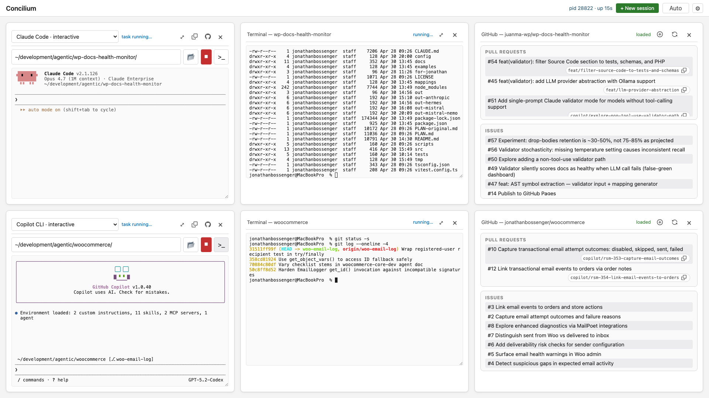
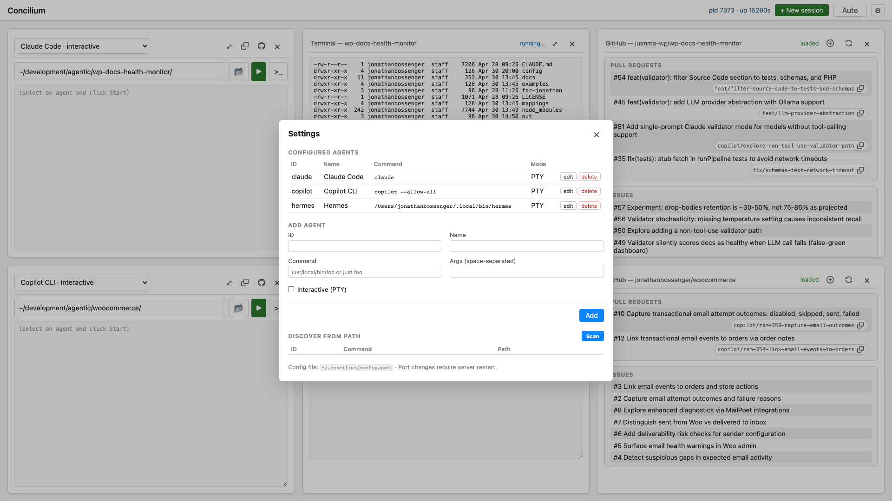
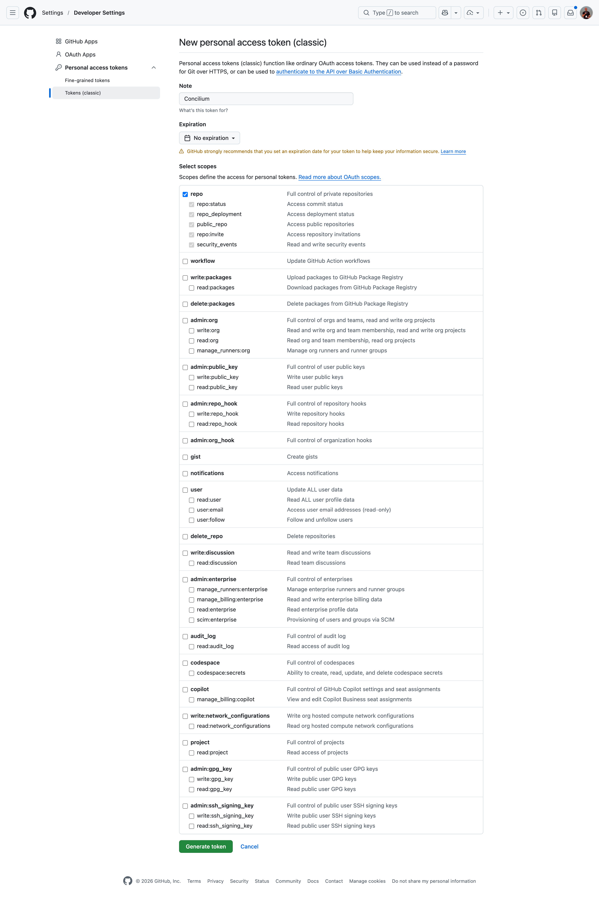

# Concilium

A straightforward, locally-installed multi-agent orchestration dashboard. Configure CLI
AI agents you have on your machine (Claude Code, Codex, Aider, Gemini, Copilot,
Ollama, …), fire off tasks, watch live output, and keep a history — from a
loopback web UI. Easy to start, stop, and restart, like Apache.

Your council of agents - Concilium!



<!-- When renaming a heading below, also update the matching link in this list. -->
## Table of contents

- [Features](#features)
- [Requirements](#requirements)
- [Install](#install)
- [Usage](#usage)
  - [Standalone](#standalone)
  - [As a user service (auto-start on login)](#as-a-user-service-auto-start-on-login)
  - [Web UI](#web-ui)
  - [GitHub personal access token (optional)](#github-personal-access-token-optional)
- [Configuration](#configuration)
- [API](#api)
- [Project layout](#project-layout)
- [License](#license)

## Features

- **Card-based session UI** — each card is an independent agent session with
  its own selector, working directory, prompt, output, and (for interactive
  agents) input line. Add cards with **+ New session**, close them when done.
  Card controls are compact icon buttons: 📂 opens the OS folder picker for
  the working directory, ▶ starts the task (turns red while a task is
  running, click to kill), **>_** opens a pop-out terminal card (see
  below), and **⤢** expands a single card to fill the main area with a
  smooth View Transitions animation between states. When the working
  directory resolves to a GitHub repo (via `git remote`), an octocat link
  to the repo appears in the card header. A **⧉** clone button next to it
  duplicates the card with the same agent and working directory, then
  starts the new session immediately. Paths under `$HOME` display as
  `~/...` shorthand in the cwd field; the server expands them at launch.
  Drag a card by its header to reorder it on the grid; the new order is
  persisted to the saved layout. Header controls (select, buttons, GitHub
  link) stay clickable; dragging is disabled while a card is expanded.
- **Pop-out terminal cards** — the **>_** button on any session card opens
  an independent shell terminal in a new card (using `$SHELL`, inserted
  right after the triggering card). Useful for running side commands —
  `git status`, `ls`, `tail` — in the same working directory as your agent
  without leaving the dashboard. Terminal cards expand and close like any
  other card; closing one ends the shell and drops its history.
- **Session restore** — the card layout (agent, working directory, last task)
  is persisted server-side in SQLite, so reloading the page or restarting
  the server brings your sessions back. Closing a card permanently removes
  it (and the tasks it launched) from the saved layout.
- **Two execution modes** — piped stdin for one-shot tools, PTY (via `node-pty`)
  for interactive REPL-style agents
- **Real terminal in the browser** — each card embeds an
  [xterm.js](https://xtermjs.org/) terminal. ANSI/colors/cursor moves render
  natively, keystrokes go straight to the agent's stdin, and a
  `ResizeObserver` + the fit addon drive a resize handshake to the PTY so
  TUIs reflow correctly when you expand a card or resize the window.
- **Live streaming** of stdout/stderr to the browser via Server-Sent Events,
  with automatic reconnect after laptop sleep / network drops so the stream
  resumes without a manual refresh.
- **Persistent history** in SQLite, plus per-task plain-text logs under
  `~/.concilium/logs/`. Closing a card kills any running task and
  deletes that session's tasks + logs.
- **Light / dark / auto theme** — defaults to your OS preference
  (`prefers-color-scheme`); the **Auto** button in the header cycles to
  Light or Dark and persists in `localStorage`.
- **Apache-style lifecycle** — `conciliumctl start | stop | restart | status`,
  with optional install as a launchd or systemd `--user` service
- **PATH-based agent discovery** — scans `$PATH` for known CLIs and lets you
  add them with one click
- **Vanilla web UI** — no framework, no build step, just HTML/CSS/JS
- **Loopback only** (`127.0.0.1`) — single-user, no auth

## Requirements

- Node.js 18+ (tested on 24)
- macOS or Linux
- A C toolchain only if `node-pty`'s prebuilt binaries aren't available for
  your platform; on macOS arm64/x64 and Linux x64/arm64 the prebuilds are used

External CLIs the server invokes (must be on `$PATH`):

- **`git`** — required. Used to read `origin` / `upstream` remotes when
  detecting the GitHub repo for a card's working directory.
- **`gh`** ([GitHub CLI](https://cli.github.com/)) — optional but recommended.
  Authenticated (`gh auth login`) so it can call `gh agent-task list` to power
  the active-agent indicator on PR rows. Without it, the rest of the GitHub
  card still works; the 🤖 indicator just never shows.
- **`zenity`** — Linux only, optional. Powers the OS folder picker (📂) on
  GNU/Linux desktops. Without it, type or paste paths into the cwd field.
  On macOS the picker uses built-in `osascript`; on Windows it uses built-in
  `powershell`.

## Install

```bash
git clone git@github.com:jonathanbossenger/concilium.git
cd concilium
npm install
```

The `postinstall` step restores the executable bit on
`node-pty`'s `spawn-helper` (npm strips it during install — without this,
PTY spawns fail with `posix_spawnp failed.`).

To get `conciliumctl` on your `$PATH`:

```bash
npm link
```

## Usage

### Standalone

```bash
./bin/conciliumctl start         # daemonizes node, writes PID file
./bin/conciliumctl status
./bin/conciliumctl restart
./bin/conciliumctl stop
./bin/conciliumctl logs          # tail -f the server log
```

### As a user service (auto-start on login)

```bash
./bin/conciliumctl install       # writes launchd plist or systemd --user unit
./bin/conciliumctl status        # mode: service
./bin/conciliumctl uninstall
```

The install step bakes the absolute path to `node`, the project root, and
your current `$PATH` into the service definition, so the dashboard can find
agents installed via Homebrew, nvm, etc.

### Web UI

Open <http://127.0.0.1:7878> after starting. The page boots with one empty
session card; click **+ New session** to add more, or the **×** on a card
to close it (kills any running task in that card and deletes its history).

Header controls:

- **+ New session** — adds another card.
- **⧉** — placeholder button for opening a new project window.
- **🖥 / ☀ / ☾** — cycles theme (auto/light/dark); defaults to your OS preference.
- **Gear (⚙)** — opens a settings dialog where you can:
  - Add, edit, or delete agents
  - Scan `$PATH` for known CLI agents and add the ones found
  - Set or clear an optional `githubToken` used for authenticated GitHub API calls



### GitHub personal access token (optional)

Concilium can make authenticated GitHub API calls if you provide a personal
access token. Without one, requests fall back to unauthenticated and are
subject to a much lower rate limit.

Use a **classic** personal access token rather than a fine-grained one.
Fine-grained tokens are scoped to a single resource owner, so a token tied to
your own account returns `403 forbidden` against repositories owned by other
users or organisations — even ones you contribute to. Classic tokens cover
every repository you can already read.

Create a classic token at <https://github.com/settings/tokens/new>:



1. **Note** — anything memorable (e.g. `Concilium`).
2. **Expiration** — GitHub recommends setting an expiration date.
3. **Select scopes** — tick **`repo`** (Full control of private repositories).
   That single scope is enough to read issues and pull requests on any public
   or private repository you have access to. If you only need public
   repositories, **`public_repo`** alone is sufficient. No other scopes are
   needed — Concilium only reads issue and PR metadata.
4. Click **Generate token**, copy the value, then paste it into the gear
   (⚙) → GitHub token field in the Concilium UI. Submit an empty value to
   clear it.

## Configuration

State lives entirely under `~/.concilium/`:

```
~/.concilium/
├── config.yaml      # port + optional githubToken + agent list
├── tasks.db         # SQLite history + saved card layout
├── logs/<id>.log    # per-task plain-text output log
├── server.log       # the server's own stdout/stderr
└── run.pid          # standalone-mode PID file
```

A minimal `config.yaml`:

```yaml
port: 7878
githubToken: ""
agents:
  - id: claude
    name: Claude Code
    command: claude
    interactive: false
  - id: aider
    name: Aider
    command: aider
    interactive: true
    args: ["--no-pretty"]
```

`interactive: false` → stdin is piped in, then closed (one-shot).
`interactive: true` → spawned under a PTY; stays alive for follow-up input.
`githubToken` is optional and used for authenticated GitHub API requests.

Edits via the UI take effect immediately. Editing the YAML by hand requires
a restart (`conciliumctl restart`).
`config.yaml` may contain a secret token — keep it readable only by your user.

## API

All endpoints are JSON; loopback only.

| Method | Path | Description |
|---|---|---|
| `GET`    | `/api/health` | server pid, uptime |
| `GET`    | `/api/agents` | list configured agents |
| `POST`   | `/api/agents` | create agent `{id, name, command, args?, interactive}` |
| `PATCH`  | `/api/agents/:id` | update fields |
| `DELETE` | `/api/agents/:id` | remove |
| `GET`    | `/api/agents/discover` | scan `$PATH` for known CLIs |
| `GET`    | `/api/tasks` | task history (newest first) |
| `POST`   | `/api/tasks` | start task `{agent_id, prompt?, cwd?}` → `{task_id}` |
| `POST`   | `/api/tasks/terminal` | start a `$SHELL` PTY task `{cwd?}` → `{task_id}` (powers pop-out terminal cards) |
| `GET`    | `/api/tasks/:id` | task + all events |
| `DELETE` | `/api/tasks/:id` | remove task (kills first if live), drops events + log file |
| `POST`   | `/api/tasks/:id/kill` | SIGTERM the running task |
| `POST`   | `/api/tasks/:id/input` | send stdin to interactive task `{data}` |
| `POST`   | `/api/tasks/:id/resize` | resize the PTY `{cols, rows}` (PTY mode only) |
| `GET`    | `/api/stream/:id` | SSE: replays past events then streams live |
| `POST`   | `/api/system/pick-directory` | open the OS folder picker, returns `{path}` |
| `POST`   | `/api/system/github-url` | `{path}` → `{url}` if the directory's `origin`/`upstream` remote points at GitHub |
| `GET`    | `/api/system/github-token` | returns whether `githubToken` is configured |
| `POST`   | `/api/system/github-token` | save/clear configured `githubToken` (submit empty to clear) |
| `GET`    | `/api/system/layout` | the saved card layout (array of `{agentId, cwd, lastTaskId}`) |
| `POST`   | `/api/system/layout` | replace the saved card layout |

## Project layout

```
concilium/
├── bin/conciliumctl                # lifecycle CLI
├── install/                    # launchd & systemd templates
├── public/                     # vanilla HTML/CSS/JS UI
├── scripts/fix-pty-perms.js    # postinstall fixup
└── server/
    ├── index.js                # Express entry
    ├── config.js               # YAML load/save (atomic)
    ├── discover.js             # PATH scan
    ├── runner.js               # spawn vs. PTY
    ├── manager.js              # live task registry, broadcast
    ├── store.js                # SQLite (tasks + events)
    ├── util/path.js            # tilde expansion (~/foo → /home/me/foo)
    └── routes/
        ├── agents.js
        ├── tasks.js            # incl. /terminal for pop-out shell cards
        ├── stream.js
        └── system.js           # native OS folder picker
```

Runtime dependencies: `express`, `better-sqlite3`, `js-yaml`, `node-pty`,
`@xterm/xterm`, `@xterm/addon-fit` (the latter two are served straight from
`node_modules` via static mounts at `/vendor/xterm` and
`/vendor/xterm-addon-fit` — no bundler).

## License

GPL-2.0-or-later. Free as in freedom, not just free beer. See `LICENSE`.
